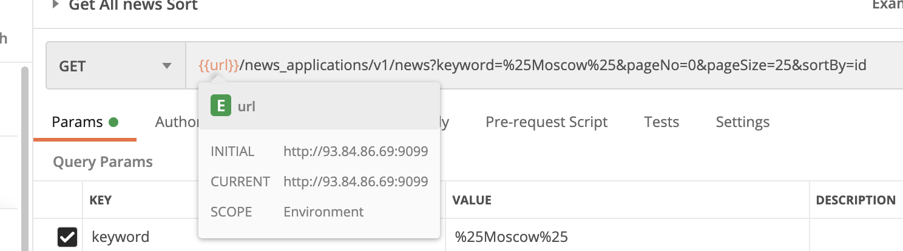
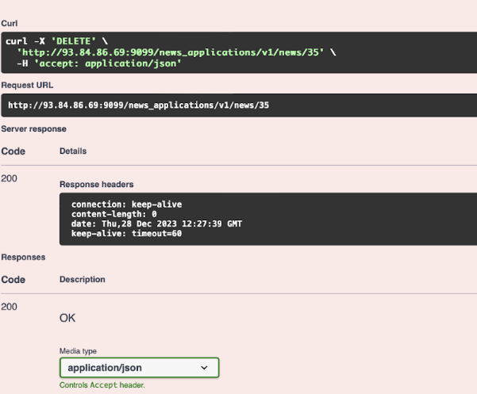

==== 1. POSTMAN
====== а) Добавить данные в формате новостей (3- 4 строчки в text)
_Request_

Метод POST http://93.84.86.69:9099/news_applications/v1/news

 Body:
{
  "title": "23 года дружбы с тигровой акулой",
  "text": "Джим Абернети и тигровая акула Эмма впервые встретились в 2001 году, когда дайвер извлек крючок из ее пасти. Американец сравнил акулу с большой собакой, потому что она во время встреч тоже радуется ему и ждет, чтобы он погладил ее. Эмма узнает Джима, даже если он меняет снаряжение для дайвинга.",
  "userName": "Пентка Ирина Александровна"
}

_Response 200 OK:_

 {
"id": 120,
"title": "23 года дружбы с тигровой акулой",
"text": "Джим Абернети и тигровая акула Эмма впервые встретились в 2001 году, когда дайвер извлек крючок из ее пасти. Американец сравнил акулу с большой собакой, потому что она во время встреч тоже радуется ему и ждет, чтобы он погладил ее. Эмма узнает Джима, даже если он меняет снаряжение для дайвинга.",
"userName": "Пентка Ирина Александровна",
"time": "2023-12-28T12:07:53.833821256"
}

====== б) Добавить в поле title время предоставлении доступа к ссылке на google Doc в формате дд-мм-гггг
_Request_

Метод PUT http://93.84.86.69:9099/news_applications/v1/news/120

 Body:
 {
"title": "23 года дружбы с тигровой акулой {{CurrentDate}}",
"text": "Джим Абернети и тигровая акула Эмма впервые встретились в 2001 году, когда дайвер извлек крючок из ее пасти. Американец сравнил акулу с большой собакой, потому что она во время встреч тоже радуется ему и ждет, чтобы он погладил ее. Эмма узнает Джима, даже если он меняет снаряжение для дайвинга.",
"userName": "Пентка Ирина Александровна"
}

_Response 200 OK:_

 {
"id": 120,
"title": "23 года дружбы с тигровой акулой 28-12-2023",
"text": "Джим Абернети и тигровая акула Эмма впервые встретились в 2001 году, когда дайвер извлек крючок из ее пасти. Американец сравнил акулу с большой собакой, потому что она во время встреч тоже радуется ему и ждет, чтобы он погладил ее. Эмма узнает Джима, даже если он меняет снаряжение для дайвинга.",
"userName": "Пентка Ирина Александровна",
"time": "2023-12-28T17:34:37.482069049"
}

====== в) Прикрепить ответ от сервиса при GET запросе о вашей записи
 [
    {
        "id": 120,
        "title": "23 года дружбы с тигровой акулой 28-12-2023",
        "text": "Джим Абернети и тигровая акула Эмма впервые встретились в 2001 году, когда дайвер извлек крючок из ее пасти. Американец сравнил акулу с большой собакой, потому что она во время встреч тоже радуется ему и ждет, чтобы он погладил ее. Эмма узнает Джима, даже если он меняет снаряжение для дайвинга.",
        "userName": "Пентка Ирина Александровна",
        "time": "1970-01-01T17:34:37.482069"
    }
]

====== г) Создать коллекцию методов (используемых в д.з.) в postman и предоставить экспортируемый файл коллекции

https://drive.google.com/drive/folders/1Hdu2_Tq8BXYYEGOdxJIWzI05ju1l5MI2?usp=share_link[https://drive.google.com/drive/folders/1Hdu2_Tq8BXYYEGOdxJIWzI05ju1l5MI2?usp=share_link]

====== д) использовать в url переменную с неизменяемым доменным адресом

====== е) попользоваться сортировкой «?keyword=%25%25&pageNo=0&pageSize=5&sortBy=id»
 {{url}}/news_applications/v1/news?keyword=%25Moscow%25&pageNo=0&pageSize=25&sortBy=id

==== 2. SWAGGER
====== а) удалить все записи на английском языке (каждый по одной, смотрю логи).
удалила запись id = 35

